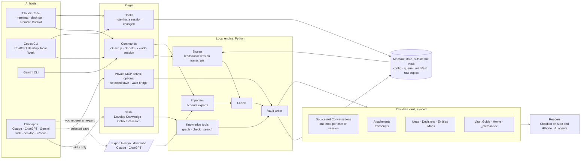

# Connected Knowledge

Turn your AI chats, coding sessions and documents into sourced, linked notes in
your own Obsidian vault, for Claude, ChatGPT/Codex and Gemini. Version **1.7.0**
adds three commands (`/ck-setup`, `/ck-help`, `/ck-add-session`), a new vault
structure with topic maps, and capture that saves each coding session as a short
labelled conversation note plus its full transcript. Capture stays off until you
switch it on.

This is a plugin for AI hosts. It writes ordinary Markdown into your vault; it is
not an Obsidian community plugin. Installing it connects no vault and reads no
account history.

## Start here

1. Install the plugin for your host (see [Install per host](#install-per-host)).
2. Run `/ck-setup` (`$ck-setup` in Codex). It previews everything before writing.
3. Run `/ck-help` at any time for status and the next useful step.

More detail: [installation](docs/INSTALL.md) · [practical use](docs/USAGE.md) ·
[knowledge conventions](docs/KNOWLEDGE-WORKFLOW.md) · [validation and limits](docs/VALIDATION.md) ·
[release notes](docs/RELEASE-NOTES.md) · [worked example](docs/WORKED-EXAMPLE.md)

## Architecture

Connected Knowledge is one plugin source, packaged for three AI hosts, plus a
small local engine that writes plain Markdown into your Obsidian vault. It runs
on a Mac that can reach the vault. Nothing is hosted, and nothing is captured
until you switch it on.



### Components

| Component | Where | What it does |
| --- | --- | --- |
| Commands | `skills/ck-setup`, `skills/ck-help`, `skills/ck-add-session` | Setup, help and "save this session", on every host that can run them. All three call `scripts/ck.py` |
| Skills | `skills/zettelkasten-obsidian`, `skills/research-collect` | Turn sources into linked notes; collect selected research |
| Hooks | `hooks/` | On each finished turn, record that a session changed. They never read a transcript and stay inert until capture is on |
| Sweep and transcript reader | `scripts/ck_sweep.py`, `scripts/ck_transcripts.py` | Read Claude Code and Codex transcripts once a session is idle or ended |
| Importers | `scripts/chat_import.py`, `scripts/export_bundle.py` | Read the export files you download from Claude and ChatGPT |
| Vault writer | `scripts/ck_capture.py`, `scripts/ck_render.py` | Write conversation notes, transcripts and the index, with labels and provenance; chat text is made inert |
| New vault | `scripts/starter_vault.py` | Create the folder structure, Home, Vault Guide, topic maps and, if wanted, templates |
| Private MCP server | `scripts/capture_mcp.py` | Optional. Lets a chat app save selected text and read scoped notes through your own tunnel |
| Filesystem MCP | installed by `scripts/install.py` | Optional. Lets chat in the Claude desktop app read and write folders you choose. `/ck-setup apps` offers it for that app only |
| Machine state | outside the vault | Per-Mac config, queue, manifest and raw copies, in folders only you can read. Never synced |

### Data flow

1. **Coding sessions on a Mac.** The host fires a hook when a turn ends. The hook
   queues the session. A background sweep, started when a session starts or ends,
   reads the transcript of each session that has ended or been quiet for ten
   minutes, labels it, and writes one conversation note and one transcript.
2. **Chats in the apps, including the iPhone.** These live only in your account.
   You download an export about once a month and import it on the hub Mac.
3. **One conversation, right now.** `/ck-add-session` saves the current session.
   In a chat app without file access it prepares the note, and saves it only if
   the private MCP tool is connected.
4. **Developing knowledge.** The skills read conversation notes and transcripts and
   propose idea, decision and map notes that link back to their sources.

### Vault structure

`/ck-setup` can create a new vault (full structure or minimal, with or without a
`Templates/` folder) or adopt an existing one under its own property names.

```text
<Vault>/
├── Home.md              start here: links to your main topics
├── Vault Guide.md       how the vault works, for you and for agents
├── AGENTS.md            short rules for AI agents (CLAUDE.md and GEMINI.md point to it)
├── Inbox/               quick thoughts to sort later
├── Sources/
│   ├── AI Conversations/2026/   one note per chat or coding session
│   └── Documents/               one note per article, PDF or page
├── Ideas/  Decisions/  Entities/  Projects/
├── Maps/                topic maps: main topics → subtopics
├── Attachments/
│   ├── AI Transcripts/2026/     full transcripts, generated
│   └── Session Files/
├── Templates/           only in the "with templates" variant
└── _meta/               ck/vault.json and index/conversations.<machine>.jsonl
```

Folders say what kind of note something is; topics are links, so one note can sit
under several topics. Every note carries `title`, `category`, `topics`,
`note_type`, `classification_status`, `review_status` and a stable `id`.
Conversation notes add the platform, the Mac that holds the transcript, the device
when known, the project, and the conversation's own dates.

### Install per host

| Host | Install | Then | Works | Does not work | Checked |
| --- | --- | --- | --- | --- | --- |
| Claude Code | `/plugin marketplace add LauraFlorentin/connected-knowledge`, then `/plugin install connected-knowledge@connected-knowledge-local`. For development: `claude --plugin-dir ./plugins/connected-knowledge` | `/ck-setup` | Commands, skills, hooks, local history, ongoing capture | Sessions on a Mac without the plugin | Manifests pass `claude plugin validate`; marketplace commands untested |
| Claude desktop and web chat, Cowork | Customize → Plugins → add this GitHub repository as a marketplace, or upload `claude-plugin.zip` from a release | Ask for `ck-help` | Skills, and commands as guidance. Cowork can also run hooks and scripts when it runs on your Mac | Hooks and local scripts in chat; automatic capture | Untested |
| Claude iPhone app | Nothing to install; plugins follow your account | n/a | Skills as guidance | Reaching the vault; requesting an export | Untested |
| Codex CLI, ChatGPT desktop local Work | `codex plugin marketplace add LauraFlorentin/connected-knowledge`, then install it from `/plugins` | `$ck-setup` | Skills, commands as skills, Stop hook, local history, ongoing capture | Plugin slash commands; hooks under cloud orchestration | Untested in this release |
| ChatGPT web and iPhone | No plugin install. Optional: connect the private MCP app through your own tunnel | Ask to "save this selection" | Selected saves (verified on web in 1.4) | Skills, hooks, automatic capture | Selected save verified earlier |
| Gemini CLI | Run `python3 tools/package_gemini.py`, unpack `distribution/gemini-extension.zip`, then `gemini extensions install <that folder>`. Install by URL is planned | `/ck-setup` | Skills, the three commands, per-turn capture (experimental) | History import from Gemini | Package built; Gemini CLI untested |
| Gemini app | Not possible | n/a | Nothing yet; Google Takeout import is planned | Everything else | n/a |

Requirements on the Mac that holds the vault: macOS or Linux. Setup, capture and
the commands run on the Python 3.9 that ships with macOS; the importers, PDF tools
and MCP server need Python 3.10 or later with the packaged requirements. Windows
is not supported.

## Included

| Component | Purpose |
| --- | --- |
| `/ck-setup`, `/ck-help`, `/ck-add-session` | Guided setup, status with a next step, and saving a session on demand |
| Develop Knowledge (`zettelkasten-obsidian`) | Onboard, capture, develop, retrieve, synthesize and revise knowledge |
| Collect Research (`research-collect`) | Collect explicitly selected sources into an inbox |
| Command-line Python tools | Capture and sweep sessions, check vault structure, compare existing vaults, import supplied chat JSON, develop evidence-backed graph notes, extract PDFs, create a new vault, prepare ZIP bundles |
| Templates and Vault Guide | Seven note shapes (source, conversation, idea, decision, entity, artifact, topic map) and one guide for people and agents |
| Platform manifests | Claude, Codex/ChatGPT and Gemini CLI packaging from one source |

Supplied ChatGPT and Claude export import keeps its preview, repeat detection and
edit protection; see [history import](plugins/connected-knowledge/skills/zettelkasten-obsidian/references/history-import.md).
The optional private MCP selected-save server and the Gemini CLI adapter stay
opt-in; see [private capture](plugins/connected-knowledge/skills/zettelkasten-obsidian/references/private-capture.md).
Existing vaults can be validated and compared without changes; see
[profiles and comparison](plugins/connected-knowledge/skills/zettelkasten-obsidian/references/existing-vaults.md).
Imported conversations can be developed into graph notes with citations; see the
[graph workflow](plugins/connected-knowledge/skills/zettelkasten-obsidian/references/graph-development.md).

## Build distribution files

From the repository root, using Python 3.10 or later:

```bash
python3 tools/package.py
python3 tools/package_gemini.py
python3 tools/verify_package.py
```

This creates the Claude upload ZIP, the Gemini extension ZIP, an instruction bundle
and plugin checksums under `distribution/`, then checks them. Packages contain only
files git would accept: anything listed in `.gitignore` is left out, and a
private-looking file (an export, a transcript, a key) stops the build.

## Run the local tests

The test steps need Python 3.10 or later; the stock macOS `python3` (3.9) cannot
install the development requirements.

```bash
python3 -m venv .venv
.venv/bin/python -m pip install -r plugins/connected-knowledge/skills/zettelkasten-obsidian/scripts/requirements-dev.txt
.venv/bin/python -m unittest discover -s plugins/connected-knowledge/skills/zettelkasten-obsidian/scripts/tests -v
.venv/bin/python examples/run_graph_example.py
```

Tests use synthetic temporary files only. The capture tests in `test_capture_pipeline.py`
need no packages and also run on Python 3.9.

Keep real vaults, account exports, credentials and machine state outside this
source repository.

## Design and attribution

Use stable note identities, traceable sources and explained links. Search for
existing ideas before creating new ones. Preserve disagreements and uncertainty.
Add organizational complexity only when it resolves an observed problem.

[Source attribution and implementation provenance](plugins/connected-knowledge/skills/zettelkasten-obsidian/references/sources.md)
distinguishes the integrated skill foundation, Obsidian forum guidance and original
scripts. Referenced external projects and articles retain their own terms; this
repository does not assign them a new license.
